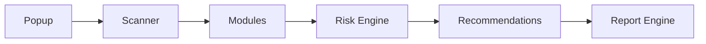

# LoginGuard Project Constitution

> **Analyze. Explain. Improve. Never Attack.**

LoginGuard is an open-source defensive browser security platform for understanding authentication-page security through passive, local, and explainable analysis.

This document is the main project constitution. It defines what LoginGuard is, what it is not, how it should evolve, and how humans and AI assistants should make future changes.

## 1. Project Identity

| Field | Value |
| --- | --- |
| Name | LoginGuard |
| Motto | Analyze. Explain. Improve. Never Attack. |
| Category | Defensive browser security platform |
| Primary interface | Chrome Extension |
| Core audience | Developers, students, educators, security teams, and authorized security researchers |

### Short Description

LoginGuard helps users analyze authentication-related pages from inside the browser. It explains what it observes, why it matters, and how developers can improve security without attacking websites or collecting sensitive data.

### Long-Term Purpose

LoginGuard should become a modular open-source platform for defensive browser security assessment. It should help teams build, teach, review, and document secure authentication experiences while preserving user privacy, consent, and authorization.

## 2. Mission

LoginGuard helps developers, students, and security teams understand authentication-page security through passive, local, explainable analysis.

The mission is to make common authentication security signals easier to inspect:

- Authentication page type.
- Login and registration form structure.
- HTTPS usage.
- Security headers.
- Cookie and session posture.
- Password-policy signals.
- Browser-visible defensive controls.
- Risk and recommendation summaries.

LoginGuard should reduce the gap between secure development knowledge and everyday engineering workflows. A user should be able to open a page they are authorized to inspect, click the extension, and receive clear, educational findings.

## 3. Vision

LoginGuard starts as a Chrome Extension, but it should grow into a modular open-source defensive browser security platform.

The first interface is intentionally simple: inspect the currently opened page and explain what is visible to the browser. Over time, the project should evolve into a broader ecosystem with reusable engines, modules, reports, plugins, and developer tooling.

The platform must remain grounded in one rule: LoginGuard helps people improve security; it does not help people attack websites.

## 4. What LoginGuard Is

LoginGuard is:

| Identity | Meaning |
| --- | --- |
| Defensive security tool | It helps users understand and improve security posture. |
| Educational project | It teaches why findings matter and how to reason about them. |
| Browser security assessment platform | It analyzes browser-visible authentication-page signals. |
| Modular framework | It organizes checks as isolated modules with structured outputs. |
| Open-source community project | It welcomes safe, documented, beginner-friendly contributions. |

## 5. What LoginGuard Is Not

LoginGuard is not:

- An exploitation framework.
- A brute-force tool.
- A credential stuffing tool.
- A phishing toolkit.
- Malware.
- Spyware.
- An automated attack platform.
- A payload delivery tool.
- A vulnerability weaponization system.
- A tool for unauthorized testing.

LoginGuard must never be framed, designed, documented, or extended as an offensive platform.

## 6. Non-Negotiable Security Rules

These rules are permanent project boundaries.

| Rule | Requirement |
| --- | --- |
| Never submit forms | Modules must not trigger login, registration, recovery, MFA, or other form submissions. |
| Never collect credentials | Modules must not read, store, display, or transmit user-entered secrets. |
| Never store secrets | No passwords, tokens, session values, API keys, or one-time codes may be stored. |
| Never exfiltrate data | Findings must remain local unless a future explicit export action is user-controlled. |
| Never automate attacks | No scanning pattern may become an attack workflow. |
| Never perform brute force | No guessing, spraying, credential stuffing, enumeration, or retry automation. |
| Never inject offensive payloads | No payload delivery, exploit strings, or attack probes. |
| Never modify target pages destructively | Modules should observe, not change page state or user data. |
| Only analyze the currently opened page | Default behavior is active-tab, user-initiated analysis. |
| Prioritize consent and authorization | LoginGuard is for systems the user owns, administers, studies in a lab, or has permission to assess. |

If a proposed feature conflicts with these rules, it does not belong in LoginGuard.

## 7. Product Tracks

LoginGuard has two product tracks: a lightweight user-facing extension and a reusable core platform.

### LoginGuard Lite

LoginGuard Lite is the simple Chrome Extension experience.

| Capability | Purpose |
| --- | --- |
| Authentication detection | Identify likely authentication surfaces. |
| Authentication classification | Classify Login, Registration, Password Recovery, Password Reset, MFA / 2FA, SSO, or Unknown. |
| HTTPS check | Explain whether the current page uses HTTPS. |
| Security headers | Show common security headers as Present / Missing. |
| Cookies | Review browser-visible cookie security attributes. |
| Basic risk score | Summarize observed issues with explainable severity. |
| Recommendations | Provide short developer-focused improvements. |
| Reports | Export local findings for authorized review. |

### LoginGuard Core

LoginGuard Core is the future reusable platform foundation.

| Component | Purpose |
| --- | --- |
| Modular framework | Shared structure for modules, engines, and outputs. |
| Scanner engine | Coordinates page analysis and module execution. |
| Module system | Defines module contracts, lifecycle, and boundaries. |
| Risk engine | Converts module findings into severity and score. |
| Recommendation engine | Explains what to improve and why. |
| Report engine | Produces local, privacy-aware reports. |
| Future Plugin SDK | Enables reviewed defensive third-party modules. |
| Future CLI | Supports repeatable local analysis workflows. |
| Future dashboard | Helps review findings and reports over time. |

## 8. Architecture Principles

LoginGuard architecture should be modular, explainable, and conservative.

| Principle | Meaning |
| --- | --- |
| Modular design | Each capability lives in a focused module or engine. |
| Single responsibility modules | A module should do one thing and return structured results. |
| Passive local analysis | Modules inspect current browser-visible state without attacking or modifying the target. |
| UI separated from scanner logic | Popup rendering must not contain core detection logic. |
| Structured module results | Modules return serializable objects with findings, reasons, and recommendations. |
| Risk engine consumes module outputs | Risk scoring should aggregate module results without duplicating module internals. |
| Recommendations explain why | Every recommendation should connect to an observed signal. |



## 9. Module Rules

Every module must define and document:

| Field | Requirement |
| --- | --- |
| Purpose | What the module checks and why it exists. |
| Inputs | What browser-visible data the module reads. |
| Outputs | The structured result shape returned by the module. |
| Responsibilities | What the module owns and what it does not own. |
| Privacy impact | What data is accessed and how sensitive data is avoided. |
| Security boundaries | How the module remains passive and defensive. |
| Recommendations | What remediation guidance the module can produce. |

### Current and Future Modules

| Module | Role |
| --- | --- |
| Authentication | Detect and classify authentication-related pages. |
| Headers | Inspect common security headers when available. |
| Cookies | Review browser-visible cookie security attributes. |
| Password Policy | Analyze visible password policy and UX indicators without reading entered passwords. |
| CSRF Indicators | Detect passive indicators of CSRF protections without submitting forms. |
| JWT | Identify safe browser-visible JWT storage signals without collecting token values. |
| Session | Review session-management indicators and cookie posture. |
| Storage | Inspect local/session storage usage patterns without exfiltrating values. |
| CORS | Explain browser-visible CORS-related signals where available. |
| TLS | Summarize browser-visible transport security context. |
| Reports | Create local, user-controlled reports. |
| Plugins | Support reviewed defensive extensions to the module ecosystem. |

## 10. Development Workflow

Use this process for meaningful changes:

1. Plan the change and identify the affected modules or docs.
2. Design the data flow, result shape, privacy impact, and UI impact.
3. Implement the smallest focused change that satisfies the goal.
4. Review for security boundaries, readability, and maintainability.
5. Test in Chrome with pages you own or are authorized to inspect.
6. Commit with a clear Conventional Commit message.
7. Push to the appropriate branch.
8. Update docs when behavior, architecture, permissions, or module contracts change.

For documentation-only changes, still review the security language and project direction.

## 11. Git Standards

LoginGuard uses Conventional Commits.

| Prefix | Use |
| --- | --- |
| `feat:` | New user-facing capability or module behavior. |
| `fix:` | Bug fix. |
| `docs:` | Documentation-only change. |
| `refactor:` | Internal restructuring without behavior change. |
| `test:` | Test additions or changes. |
| `chore:` | Maintenance tasks. |

Examples:

```text
feat: add cookie analyzer
docs: update security model
refactor: improve scanner architecture
```

## 12. Documentation Philosophy

Documentation must explain:

- What the feature does.
- Why it matters.
- How it works.
- What it does not do.
- Privacy and security impact.
- Permission changes, when relevant.
- Limitations and assumptions.

Good documentation should be useful to new contributors, maintainers, security reviewers, and future AI assistants.

## 13. UI Philosophy

The popup should be:

- Simple.
- Fast.
- Readable.
- Educational.
- Explainable.
- Not scary.
- Useful for repeated developer workflows.

The UI should avoid alarmist language. It should distinguish observed facts from recommendations and should explain confidence, severity, and uncertainty.

## 14. Risk Engine Philosophy

Risk scores must be explainable.

Rules:

- Never show risk without reasons.
- Never exaggerate findings.
- Never imply exploitation occurred.
- Distinguish missing signals from confirmed vulnerabilities.
- Prefer clear remediation over vague warnings.

Use clear severity levels:

| Severity | Meaning |
| --- | --- |
| Info | Helpful context or neutral observation. |
| Low | Minor improvement opportunity. |
| Medium | Meaningful security hardening gap. |
| High | Important issue likely to affect authentication security. |
| Critical | Severe condition requiring immediate review. |

Critical severity should be rare and must require strong evidence.

## 15. Ethics and Privacy

LoginGuard follows an authorization-first security model.

Ethical commitments:

- Authorization first.
- Privacy by design.
- No telemetry by default.
- Local-first analysis.
- No credential handling.
- Responsible disclosure mindset.
- Educational explanations over fear-based messaging.

LoginGuard should help users improve systems they own, administer, study in a lab, or have explicit permission to assess.

## 16. Future Roadmap

| Version | Focus |
| --- | --- |
| v0.1 | Authentication Detection |
| v0.2 | Authentication Classification |
| v0.3 | Security Headers |
| v0.4 | Cookie Analyzer |
| v0.5 | Risk Engine Improvements |
| v0.6 | Recommendation Engine |
| v0.7 | Report Export |
| v0.8 | Plugin Architecture |
| v1.0 | Stable Chrome Extension |

Future platform work:

- CLI.
- Web Dashboard.
- Plugin SDK.
- Community Modules.
- Documentation Website.
- Optional Lab Mode for local/CTF environments only.

Lab Mode must never become an excuse to add unauthorized or offensive functionality to the default product.

## 17. AI Assistant Instructions

This section is for ChatGPT, Codex, and other AI coding assistants working on LoginGuard.

Before making changes:

1. Read `PROJECT.md`.
2. Preserve passive analysis.
3. Do not add offensive functionality.
4. Keep modules isolated.
5. Update docs when behavior changes.
6. Prefer small focused changes.
7. Explain architectural decisions.
8. Ask before changing project direction.

AI assistants must not:

- Add payloads.
- Add brute force behavior.
- Add credential collection.
- Add form submission automation.
- Add hidden network requests.
- Reframe LoginGuard as an attack tool.
- Make broad architectural changes without clear justification.

When implementing a module, the assistant should identify inputs, outputs, privacy impact, security boundaries, recommendations, and test strategy.

## 18. LoginGuard DNA

Quality over quantity.

Clarity over cleverness.

Architecture over shortcuts.

Documentation over assumptions.

Community over ego.

Education over exploitation.

Long-term sustainability over rapid feature growth.
