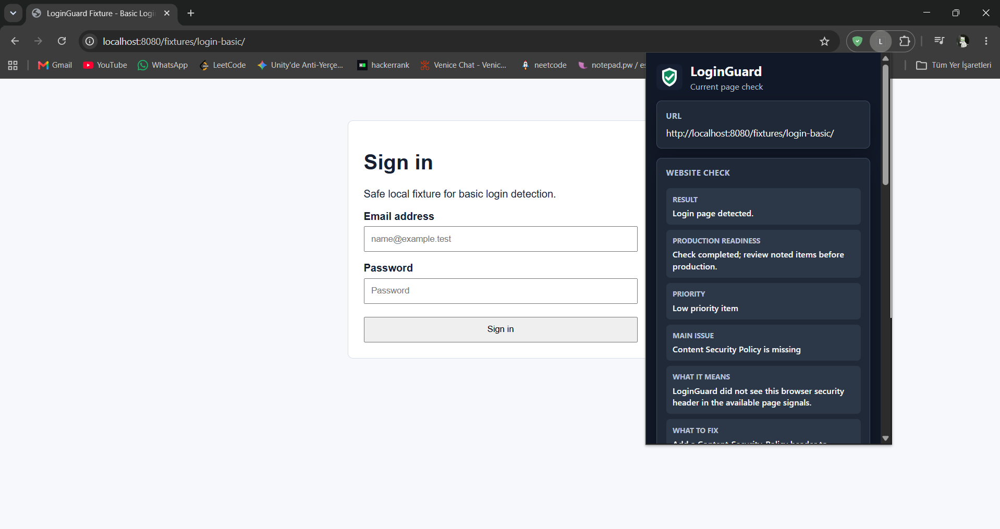
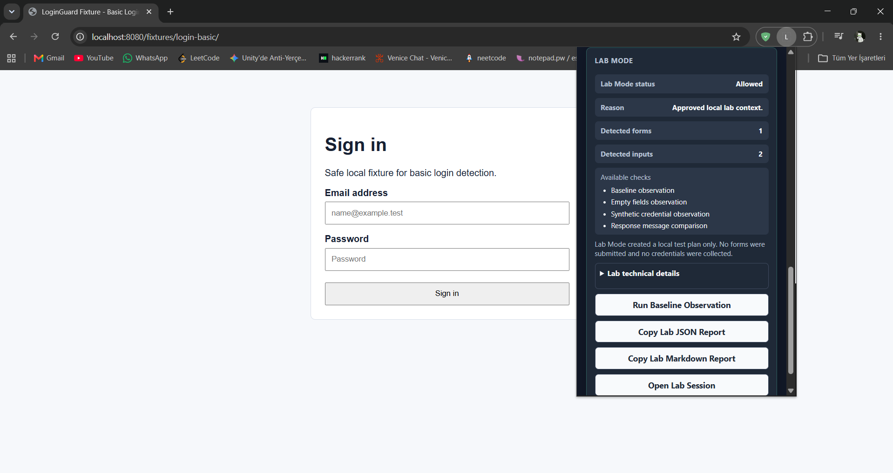

# LoginGuard - Login Page Readiness Checks

**LoginGuard is a Chrome extension for login page readiness checks and authorized lab testing workflows.**

Chrome can tell you whether a connection is secure. LoginGuard focuses on what the browser lock icon does not explain: whether a login page has common readiness issues, what should be fixed, and how authorized lab checks can be reported.

LoginGuard is defensive, local-first, and built to turn login-page checks into clear, actionable reports. It does not prove that a site is fully secure, and it is not a replacement for Chrome security warnings or a professional penetration test.

> Analyze. Explain. Improve. Never Attack.

`PROJECT.md` is the source of truth for project direction, safety boundaries, architecture decisions, and future development.

## Preview

### Website Check

LoginGuard shows a short readiness summary for website owners and developers.



### Lab Session

Lab Session provides a persistent workspace for authorized lab checks and reports.



## Who is LoginGuard for?

- Website owners who want a simple login-page readiness check.
- Developers reviewing authentication pages before production.
- Students learning authentication security concepts in safe environments.
- Pentesters working in authorized local, lab, or training environments.

## Product Modes

### Website Check

Website Check is the default product mode for website owners and developers.

It:

- Checks login and authentication pages for common readiness issues.
- Explains findings in plain language.
- Shows what should be fixed first.
- Helps frame missing controls as production-readiness work.
- Does not submit forms or read passwords.

Website Check is not trying to replace Chrome's secure/not-secure indicator. It focuses on developer-facing readiness signals such as authentication detection, HTTPS/local context handling, security headers, plain-language explanations, and fix guidance.

### Lab Mode

Lab Mode is for `localhost`, local fixtures, and explicitly authorized lab environments.

It:

- Helps pentesters and students move faster through controlled login-surface checks.
- Supports Lab Session as a persistent workspace.
- Supports approved metadata-only Baseline Observation.
- Supports Lab JSON and Markdown reports.
- Uses confirmation and control gates before execution.
- Does not run unauthorized tests.

Lab Mode is separate from Website Check. Active Lab Mode checks must remain restricted to local or authorized lab contexts.

## What LoginGuard checks today

Current prototype capabilities include:

- Login and authentication page detection.
- Authentication type classification.
- HTTPS and local context handling.
- Basic security header review.
- Plain-language Website Check summary.
- Lab Mode preview.
- Persistent Lab Session page.
- Metadata-only Baseline Observation.
- Lab JSON and Markdown reports.
- Copy JSON Report.
- Copy Markdown Report.
- AI Analyst Prompt export.
- Local fixtures for manual testing.

## What LoginGuard does not do

LoginGuard does not:

- Prove a site is fully secure.
- Replace a professional penetration test.
- Replace Chrome's browser security warnings.
- Collect credentials.
- Read passwords or input values.
- Submit forms in Website Check.
- Run active checks outside authorized or local lab contexts.
- Perform brute force or password spraying.
- Provide exploit payloads or bypass instructions.
- Send hidden network requests.

## Safety Model

LoginGuard is passive by default.

Website Check analyzes the current page locally and reports browser-visible login-page readiness signals. It does not submit forms, read passwords, change values, collect credentials, or run payloads.

Lab Mode is restricted to local or explicitly authorized environments. Controlled Lab Mode execution requires explicit confirmation and control gates before it can run. The current Baseline Observation records approved metadata only.

Reports avoid credentials, tokens, cookies, storage contents, page HTML, passwords, and form values.

## Current Status

LoginGuard is currently an early-stage prototype. The current focus is safe architecture, clear reporting, and controlled Lab Mode workflows before adding broader test packs.

The extension is useful for local demonstrations and early workflow testing, but the project is still evolving.

## Reporting

LoginGuard can copy local reports from the popup:

- **JSON report:** structured data for developer notes, issue tracking, or future tooling.
- **Markdown report:** readable report for sharing with developers, students, or internal teams.
- **AI Analyst Prompt:** local prompt text for optional defensive analysis in an AI assistant.
- **Demo report:** see [docs/demo-report.md](docs/demo-report.md) for a product-demo style report generated from a local fixture.

Lab Mode can also copy:

- **Lab JSON report**
- **Lab Markdown report**

Reports are generated locally from the current analysis result or Lab Mode plan and copied to the clipboard. LoginGuard does not send report data anywhere and does not store reports automatically.

## Product Vision

LoginGuard starts as a Chrome extension, but the long-term direction is a defensive authentication-surface reporting ecosystem.

| Layer | Direction |
| --- | --- |
| Public Extension | Quick single-page login-page readiness checks and local reporting. |
| Business Monitoring | Future authorized domain inventory, one-time scans, scheduled scans, change detection, history, and team-friendly reports. |
| AI Analyst | Future report explanation, priority guidance, developer task generation, executive summaries, and remediation guidance. |
| Fix Assistant | Future reviewed suggestions for defensive configuration and code hardening. |
| Lab Mode | Local/CTF/lab learning layer separated from public/business Website Check workflows. |

LoginGuard should help users and organizations understand, monitor, explain, and improve authentication security without becoming a general-purpose attack platform.

## Quick Start

1. Clone this repository.
2. Open Chrome and go to `chrome://extensions`.
3. Enable **Developer mode**.
4. Click **Load unpacked**.
5. Choose the LoginGuard project folder.
6. From the repository root, serve the fixtures locally:

```powershell
py -m http.server 8080
```

7. Open the local demo fixture:

```text
http://localhost:8080/fixtures/login-basic/
```

8. Click the LoginGuard extension icon.

After reloading the extension, refresh the inspected page before opening the popup if you want browser-observed response headers to be available.

## Project Documentation

- [PROJECT.md](PROJECT.md) - project constitution, architecture direction, safety boundaries, and AI development guidance.
- [ROADMAP.md](ROADMAP.md) - practical development phases and future product direction.
- [SECURITY.md](SECURITY.md) - security policy, responsible disclosure, and authorized-use boundaries.
- [CHANGELOG.md](CHANGELOG.md) - prototype milestone history.
- [docs/lab-mode.md](docs/lab-mode.md) - Lab Mode scope and restrictions.
- [docs/json-report.md](docs/json-report.md) - local JSON report format.
- [docs/ai-analyst-prompt.md](docs/ai-analyst-prompt.md) - local AI Analyst Prompt behavior and safety boundaries.
- [docs/manual-test-matrix.md](docs/manual-test-matrix.md) - manual fixture testing notes.
- [docs/demo-report.md](docs/demo-report.md) - product-demo style local fixture report.

## Repository Structure

```text
.
|-- manifest.json
|-- README.md
|-- PROJECT.md
|-- ROADMAP.md
|-- SECURITY.md
|-- assets/
|   `-- icons/
|-- docs/
|-- fixtures/
|-- src/
|   |-- background/
|   |-- content/
|   |-- core/
|   |-- lab/
|   |-- modules/
|   |-- popup/
|   `-- utils/
`-- .github/
```

## Contributing

Contributions are welcome when they support LoginGuard's defensive mission.

Good contributions include clearer readiness checks, safer detection logic, better explanations, documentation, local fixtures, accessibility improvements, UI polish, tests, and modular architecture improvements.

Do not contribute offensive payloads, credential collection, brute-force workflows, phishing support, hidden telemetry, bypass guidance, or unauthorized scanning behavior.
