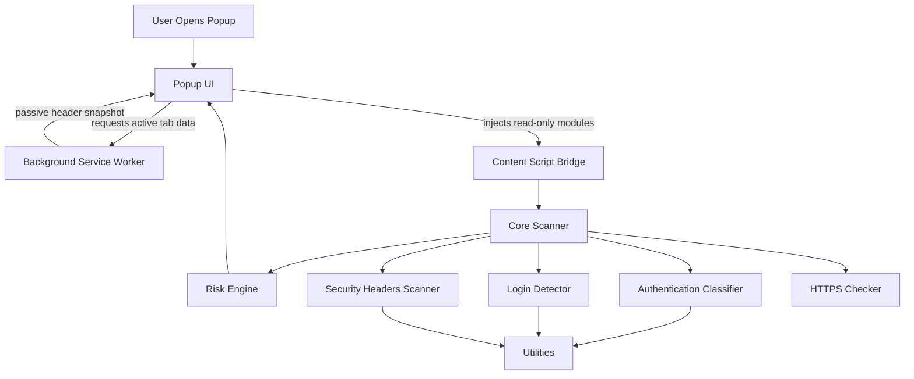
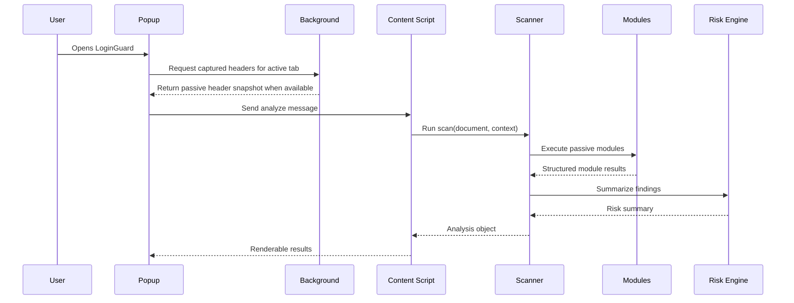
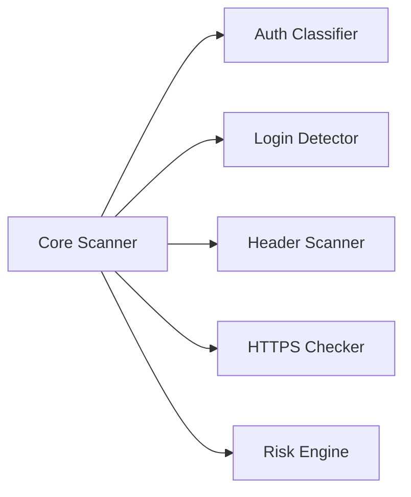
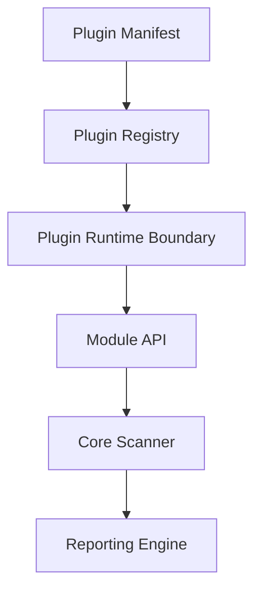

# LoginGuard Architecture

LoginGuard is designed as a modular defensive browser security platform. The current implementation is a Manifest V3 Chrome Extension that analyzes the active page after the user opens the popup.

## Current Architecture

## Data Flow

## Component Responsibilities

| Component | Responsibility |
| --- | --- |
| Popup | Presents findings, requests active-tab analysis, and renders module results. |
| Background Service Worker | Handles lifecycle events and passive response-header capture where Chrome APIs allow it. |
| Content Script Bridge | Receives popup messages and runs the scanner against the current document. |
| Core Scanner | Orchestrates modules and returns a single structured analysis object. |
| Modules | Perform focused passive checks and return structured results. |
| Risk Engine | Converts module outputs into concise summaries and severity-oriented context. |
| Utilities | Provide shared DOM and data helpers for modules. |

## Module Relationship

Modules should be independent. They may share utility functions, but they should not depend on popup rendering details or mutate page state.

## Future Plugin System

The future plugin system should define:

- A plugin manifest format.
- A stable module API.
- Permission declarations.
- Safety validation rules.
- Version compatibility.
- Local-only execution defaults.
- Clear reporting contracts.

## Architectural Rules

- Modules must be passive by default.
- Modules must not submit forms.
- Modules must not inject payloads.
- Modules must not collect user-entered credentials.
- Modules must not make hidden network requests.
- New permissions must be documented with purpose, scope, and risk.
- Findings must be structured, explainable, and suitable for reports.
