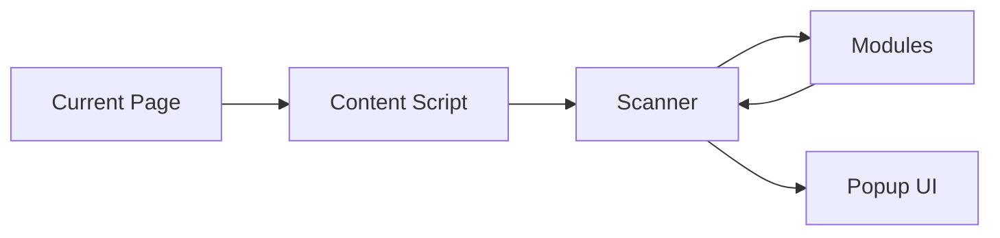

# LoginGuard Security Model

LoginGuard is a defensive, educational, authorized browser security platform. Its security model is designed around passive local analysis of the currently opened page.

## Security Objectives

- Protect user privacy.
- Avoid changing target page behavior.
- Avoid offensive functionality.
- Make all findings explainable.
- Keep analysis local by default.
- Require documentation for permissions and data flows.

## Passive Analysis Only

LoginGuard modules inspect browser-visible information such as:

- DOM structure.
- Page title and headings.
- Form metadata.
- Input types and attributes.
- Button and link text.
- URL path keywords.
- Browser-observed response headers when available.

Modules must not alter the page or attempt to trigger application behavior.

## Local Execution

Analysis runs locally in the user's browser against the active tab. The extension does not require a remote service to inspect a page.

## No Telemetry

LoginGuard does not include telemetry. It does not report usage data, visited pages, findings, or user behavior to project maintainers or third-party services.

## No Data Collection

LoginGuard should avoid collecting page data beyond what is necessary for immediate local analysis. Findings should summarize observations instead of storing raw page content.

## No Credential Storage

LoginGuard must never collect, store, transmit, log, or display user-entered credentials or secrets.

Examples of prohibited data:

- Password values.
- One-time codes.
- Session tokens.
- API keys.
- Recovery codes.
- Private user profile data.

## No Automatic Requests

LoginGuard must not send automatic requests to target applications as part of analysis. Future features that require network behavior must be explicitly designed, reviewed, documented, and disabled by default unless they remain purely local and defensive.

## No Offensive Functionality

LoginGuard does not support:

- Offensive payloads.
- Exploit delivery.
- Brute force.
- Credential stuffing.
- Enumeration attacks.
- Evasion or stealth behavior.
- Unauthorized testing workflows.
- Data exfiltration.

## Permission Model

Permissions must be minimal and documented.

| Permission Area | Purpose |
| --- | --- |
| `activeTab` | Analyze the tab the user actively selected. |
| `scripting` | Load read-only scanner modules after user action. |
| `webRequest` | Passively observe main-frame response headers when available. |
| `storage` | Store short-lived local analysis context, such as per-tab header snapshots. |
| Host permissions | Allow Chrome to expose response headers for regular HTTP and HTTPS pages. |

## Data Flow Boundaries

The default flow is one-way observation from the current page to local results. Modules do not send data away from the browser.

## Review Requirements

Security-sensitive changes should document:

- What data is accessed.
- Why the data is needed.
- Whether any new permission is required.
- How the change remains passive.
- How sensitive data is avoided.
- How users can understand the behavior.
